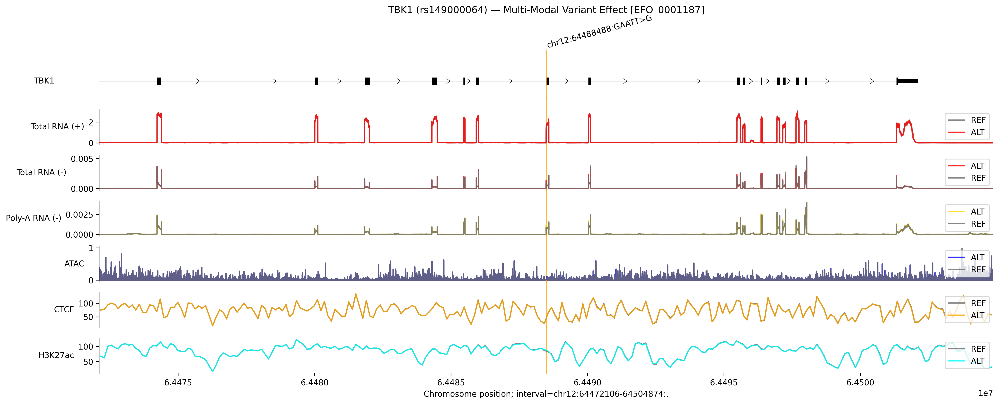

# AlphaGenome Variant Effect Pipeline

A batch pipeline for multi-modal variant effect prediction using [AlphaGenome](https://deepmind.google/research/publications/alphagenome/). Given a CSV of variants, the script predicts the effect of each variant on RNA-seq, chromatin accessibility (ATAC), CTCF binding, and histone modification (H3K27ac) in a specified cell type, and saves a figure for each variant.

---

## Requirements

- Python 3.10+
- AlphaGenome package and a valid API key ([request access here](https://deepmind.google.com/science/alphagenome/))
- Dependencies: `alphagenome`

---

## Input CSV Format

Prepare a CSV file with the following **required columns**:

**Note**: The **gene_name and rsID values** in the example CSV **may not be accurate**, they are placeholder examples for testing the code only. Please replace them with your actual variants before running.

| gene_name | rsID | chr | position | ref_allele | alt_allele |
|-----------|------|-----|----------|------------|------------|
| TBK1 | rs149000064 | chr12 | 64488488 | GAATT | G |
| TP53 | rs28934578 | chr17 | 7674220 | G | A |

- `position`: 1-based genomic coordinate (hg38)
- `ref_allele` / `alt_allele`: can be SNVs or indels
- Any extra columns in the CSV are safely ignored

A template CSV (`variants_input.csv`) is included in this repository.


---

## Usage

```bash
python alphagenome_variant_pipeline.py \
    --csv variants_input.csv \
    --output_dir ./figures \
    --api_key YOUR_API_KEY
```

### All Arguments

| Argument | Required | Default | Description |
|----------|----------|---------|-------------|
| `--csv` | ✅ | — | Path to input CSV file |
| `--output_dir` | ✅ | — | Directory to save output figures |
| `--api_key` | ✅ | — | Your AlphaGenome API key |
| `--ontology` | ❌ | `EFO:0001187` | Cell type ontology term (default: HepG2/Liver) |
| `--interval_size` | ❌ | `1048576` | Model input context window in bp (1 Mb). The model needs this large window for accurate predictions — only change if you have a specific reason |
| `--zoom` | ❌ | `32768` | Region displayed in the output figure in bp (32 kb). Does not affect prediction accuracy |

---

## Output

For each variant, the pipeline saves:
- A `.png` figure named `{gene_name}_{rsID}_{ontology}_variant_effect.png` showing REF vs ALT tracks for all modalities
- A `pipeline_summary.csv` listing the status (success/error) of each variant

Example figure for TBK1:



> *(Add your own example figure to an `example/` folder to display here)*
